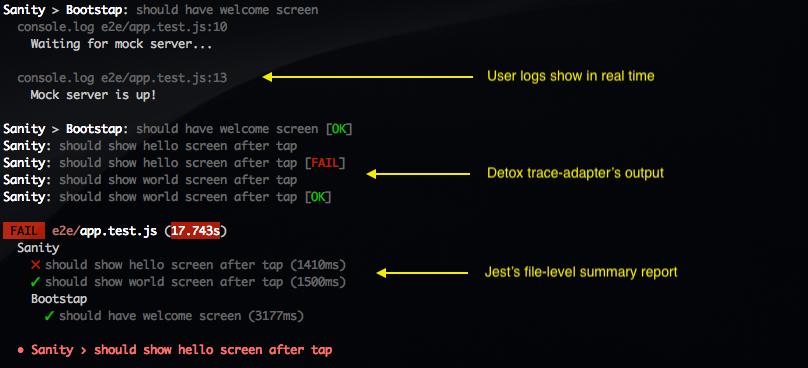

## DISCLAIMERS

- This guide describing installing Detox with Jest on a fresh project. If you're migrating an existing project, please apply some common sense in the process.
- We **strongly** recommend using Jest `24.x.x`.

## Installation

### 0. Set up Detox

If you haven't already, use the [Getting Started](Introduction.GettingStarted.md) guide to set up Detox from scratch.

### 1. Install Jest as an npm dependency

```sh
> npm install --save-dev jest
```

### 2. Run Detox init

```sh
> detox init -r jest
```

### 3. Fix & Verify

**THIS IS IMPORTANT!** Make sure that `detox init` has ended successfully (everything is green). If it hasn't, be sure to address the issues specified in red. **The ultimate reference is our Jest-based demo app, [`demo-react-native-jest`](https://github.com/wix/Detox/tree/master/examples/demo-react-native-jest)**; Go over these fundamental things:

##### The [*detox* configuration section](https://github.com/wix/Detox/blob/master/examples/demo-react-native-jest/package.json#L25) in your project's `package.json`:

- `test-runner` should be `jest`.
- `runner-config` to be set to the path of your Jest configuration file (see below). `detox init` generates it as `e2e/config.json`, which is also Jest's default (i.e. used whenever `runner-config` isn't  specified).


##### The [Jest configuration file](https://github.com/wix/Detox/blob/master/examples/demo-react-native-jest/e2e/config.json):

- In the very least, verify the following fields: `testEnvironment`, `setupFilesAfterEnv`.

  > Note: `setupFilesAfterEnv` was introduced in Jest 24.

- **`reporters` array field, `verify` bolean field:**
  We override Jest's default reporters so as to streamline logs of all flavours, in real-time - which isn't Jest's default, thus optimizing it for running e2e tests. This is optional: if you're OK with Jest's default logging, you can either remove `reporters` or set to the `"default"` item. See [Jest's docs](https://jestjs.io/docs/en/configuration#reporters-array-modulename-modulename-options) for more details.

##### The [Jest custom initialization code](https://github.com/wix/Detox/blob/master/examples/demo-react-native-jest/e2e/init.js):

- `beforeAll()`, `beforeEach()`, `afterAll()` should all call our custom Detox-Jest adapter's equivalent lifecycle methods.
- The custom Detox-Jest adapter must be registered as a `jasmine` reporter (`jasmine.getEnv().addReporter()`).
- Optional: An additional `trace-adapter` should be registered as a `jasmine` reporter, as well. This one takes care of logging on a per-spec basis (i.e. when an `it` starts and ends) — which Jest does not do by default. Should be used in conjunction with our custom reporters.



### 4. Run some tests

For example:

```sh
> react-native start
...
> detox test e2e --configuration ios.sim.debug
```

`detox init` generates default tests under the `e2e` folder. By now, you should be able to run them successfully, getting real-time, streamlined output and results.


## Writing Tests

There are some things you should notice:

- Don't worry about mocks being used, Detox works on the compiled version of your app.
- Detox exposes it's primitives (`expect`, `device`, ...) globally, it will override Jest's global `expect` object.


## Parallelism

Through Detox' cli, Jest can be started with [multiple workers](https://github.com/wix/Detox/blob/jest-boost/docs/APIRef.DetoxCLI.md#test) that run tests in simultaneously. In this mode, Jest effectively assigns one worker per each test file (invoking jasmine over it). In this mode, the per-spec logging offered by the trace-adapter mentioned earlier, does not necessarily make sense, as the workers' outputs get mixed up.

Unfortunately, there's no way of telling whether parallelism has been enabled, at the adapter's scope (different JS contexts). If you find this way of logging unsuitable in a multiple-workers environment (typically an automated CI build), consider limiting the trace-adapter's registration in your test-init file (e.g. by using a dedicated environment variable).


## How to run unit test and E2E tests in the same project

- If you have a setup file for the unit tests pass `./jest/setup` implementation into your unit setup.
- Call your E2E tests using `detox-cli`: `detox test`
